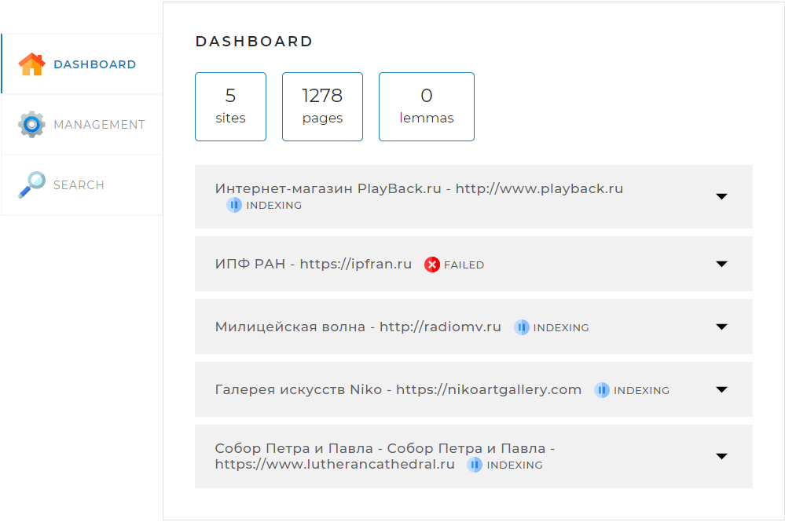
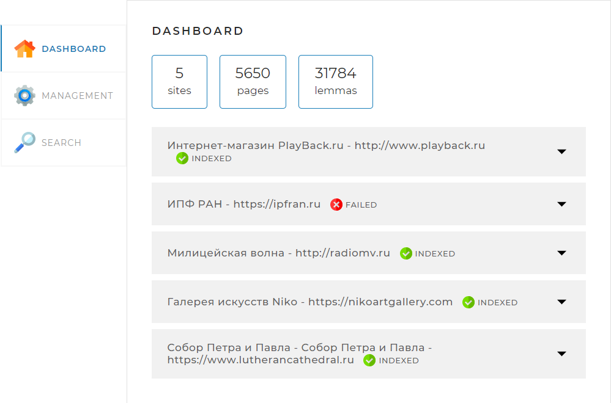
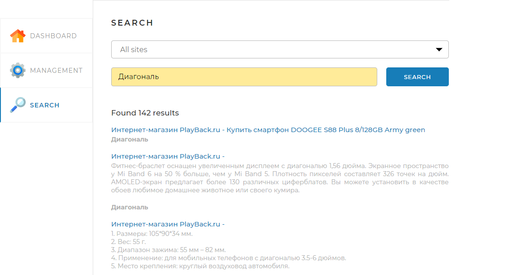

<h1 align="center">Search Engine</h1>
<h5 align="center">(Дипломный проект Skillbox)</h5>

Поисковый движок реализованный на Java в качестве дипломной работы. 
В разработке проекта исмользовались: 

- Spring Framework: 
    - Spring Boot
    - Spring Web
    - Spring Boot
    - Spring Data JPA
    - Spring Thymeleaf
- MySQL
- Jsoup
- Lombok
- Apache Lucene Morphology

Движок сканирует сайты перечисленные в application.yml, заносит в базу MySQL и производит по ним поиск. Для добывления
сайта необходимо внеси его в application.yml 
<pre>application:
 sites: </pre>
В настройках необходимо указать URL и название сайта в колонках в одноименных полях. 

<h2 align="center">Интерфейс</h2>

Графический инетфейс разделён на 3 части. 

  

Отоброжает состояние просканированных сайтов, когда сайты сканируются отображается синим значком и статусом "INDEXING"
, 

  

или когда они просканированны отображается зелёным и статусом "INDEXED", так же если сайт полностью заблокирован для
сканера, отображается красным значком со статусом "FAILED". 

 

 

Отвечает за сканирование сайтов и отдельных страниц.

 

если по какой-то причине страница сайта была не отсканированна, её можно добавить в ручную или заменить, если она была
изменена. 

 

Производит сканирование на данном этапе пока только по всем сайтом, из-за недоработки граффического интерфейса и выдаёт
их в отсортированном виде по релевантности разбивая на страницы. 

 

 

